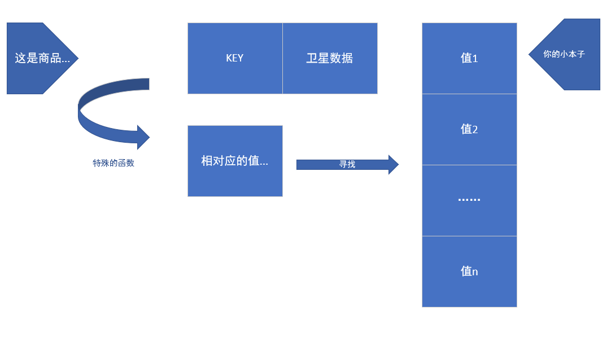
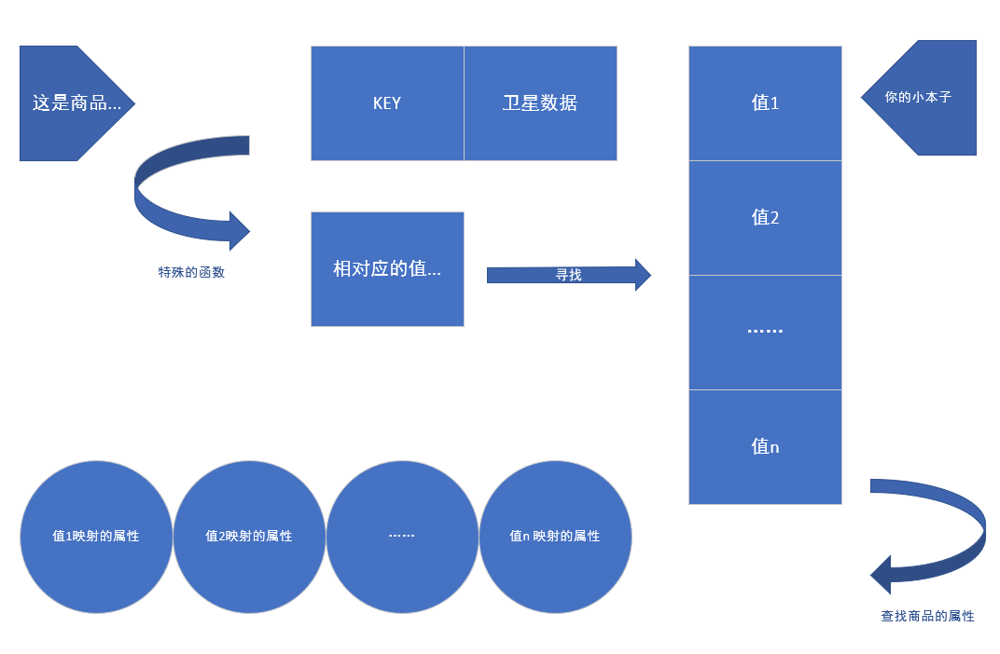
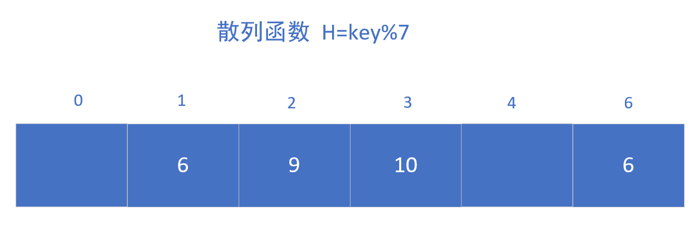
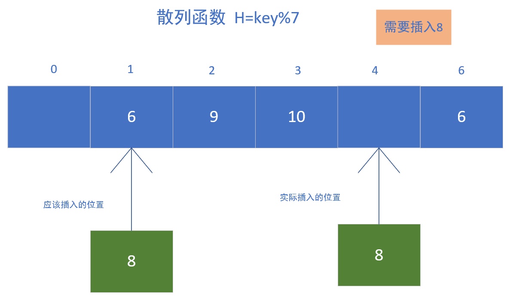
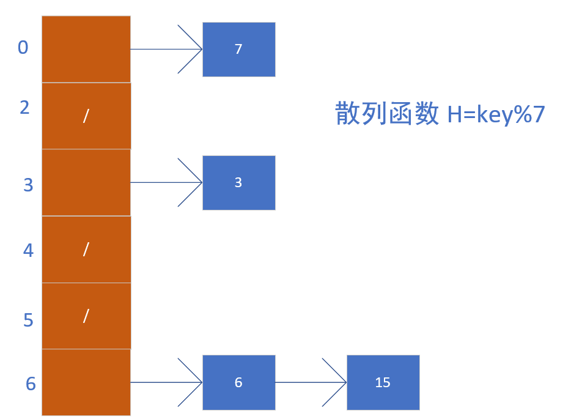

# 散列表 ( 哈希 )

<h2 id="back"></h2>

#### 简介

- [简述](#introduction)
- [散列函数](#function)
- [冲突](#conflict)
- [开放地址法](#openaddress)
- [链接法(也称链地址法)](#linkaddress)
- [链接法对比与开放地址法的优缺点](#comparewithlinkaddressopenaddress)
- [名词解释](#explain)

---

<h2 id="introduction"></h2>

我们来讲述散列表。

散列表是一种数据结构，它具有以下性质：

- 应用广泛
- 查找快速
- 等

举个例子。

你在超市工作，一位顾客来购买商品，你家超市刚刚好没有自动销售机，你得亲自去查找该商品的价格。如果我们是这样的话，那么顾客每买一个商品，都要找一下该商品并且知道它的价格。那么我们非常花费时间。如果我们能够找到这样一个人：能够记住所有商品的价格的人。那么我们在帮顾客结账的时候将会非常快速。

即使你是用一个小本本把你商店的东西都记上了，并且是按照一定的顺序记号的。即使使用二分查找，那么我们也会花费一定的时间。想必此时顾客已经不耐烦了。他们可能会说：“怎么这么久！！！”，然后你的商店可能会产生很多很多的怨气......

<h2 id="back1"></h2>

我们从数据结构的方面去看这个问题，那么所有的商品就有了这样的一个特性：**商品的key** 以及 **商品的[卫星数据](#explain)**  。

如果我们按照一个特殊的函数去把相对应的 KEY 值转换成另一个东西，并且记录在小本子上，我们只需直接翻到这个本子相对应的部分，就可以找到了该商品的价格了，以及还有其他的信息。

[返回简介](#back)

---

<h2 id="function"></h2>

#### 散列函数

那么我们的问题来了，我们该怎样创建这个数据类型呢？首先了解一下，散列函数

> 散列函数是“将输入映射到数字”

散列函数可能是没什么规律的，但是也必须得满足一定的要求：

- 必须是一致的，也就是每一个值都有它的唯一确定的一个值与它对应
- 它应该将不同的输入映射到不同的数字中。
- 应该还是离散型分布的，分布越离散，越有助于我们以后的运算
>如果不是离散性的话，那么我们就可能会导致冲突现象特别明显。就比如我们有一个函数是这样的 y=x ^2^ ,那么我们输入-1，+1的时候，他们的值是一样的，此时产生了冲突性.......

散列函数总能够精确地指出我们在小本本写的东西的地址，或者说是第几页、第几条。这样的话，你就基本不用查找了，通过一个函数，直接就能够把这个地址找到了，然后你就可以很快地给别人结账......

主要有以下的原因:

- 散列函数总是将同样的输入映射到相同的地址上。
>也就是说，我每一次调用这个散列函数的时候，它每一次都能给我相同的一个值，并且不会改变。这就说明，当你需要找到一样商品的时候，请你输入商品的 KEY 值，那么其对应的卫星数据就会很容易地被你在小本本上找到

- 散列函数将不同的输入映射到不同的地址中。
>这个也是说，当我们找了商品1，还想找商品2的时候，输入其key值，我们所得到的值也是不一样的。这样就能保证每一个商品都有一个所对应的地址，从而我们能够很好地知道该商品在我们小本本上的页数

- 散列函数是有一个上界的，这个上界就是我们小本本的最大页码。它只能返回我们小本本的最大页码，如果超过了，那这就是一个无效的散列函数。
>就好比如，我们的小本本有50页，那么我们的散列函数如果被输入一个数据之后返回51，那么我们改写到我们小本本的哪个地方呢？对吧。

一个好的散列函数需要有什么特点？
- 满足简单均匀散列假设
> 散列假设 : 每个关键子都被等可能地散列到 m 个槽位中的任何一个，并与其他关键字已散列到哪个槽位无关
- 好的方法导出的散列值，在某种程度上应独立于数据可能存在的任何模式

我们常用的构造散列函数有以下几种常用的方法

- 数字分析法
> 如果事先知道关键字集合，且每个关键字的位数比散列表的地址码位数多，每个关键字由n位数组成，如果k1k2...kn ,则可以从关键字中提取数字分布比较均匀的若干位作为散列地址

- 平方取中法
> - 如果取关键字平方后的中间几位或其组合作为散列地址，则使随机分布的关键字得到的散列地址也是随机的，具体所取的位数由表长决定。
> - 实用情况 : 不能事先了解关键字的所有情况，或难于直接从关键字中找到取值较分散的几位

- 折叠法
> 将关键字分割成位数相同的几部分，然后取这几部分的叠加和作为散列地址称为折叠法

- 除留余数法 
> 假设散列表表长为 m ，选择一个不大于 m 的数 p ，用 p 去除关键字，除后所得余数为散列地址 也就是 H( key ) = key % p ，p 可以选取小于表长的最大质数

---

<h2 id="conflict"></h2>

#### 冲突

- 定义：两个关键字可能映射到同一个槽中。我们就称这种情形为冲突

为了解决这种方法，我们可以有以下的一些思想：

- 为了解决冲突，我们精心设计一个 **散列函数**
- 可以使用开放地址法
- 可以使用链接法

通过实验，我们更能够发现，仅仅是通过设计散列函数来解决冲突是远远不够的，好比如，一个散列函数 h 必须是一个确定的，因为某一个给定的输入 k 应始终产生相同的结果 h(k)。 但是由于| U | > m，所以至少有两个关键字，其散列值是相同的。（U是全域，m是散列表大小）

###### 几种不同方法处理冲突时散列表的平均查找长度

影响平均查找长度的因素只有两个------处理冲突的方法和[装填因子](#explain)α

|冲突的处理方法|查找失败长度|查找成功长度|
|:-:|:-:|:-:|
|线性探测法|1/2 * (1+1/(1-α))|1/2 * (1+1/(1-α)^2^)|
|二次探测法/伪随机探测法|-1/α * ln(1-α)|1/(1-α)|
|链地址法|1+α/2|α+e^-α^|

[返回简介](#back)

<h2 id="openaddress"></h2>

###### 开放地址法

开放地址法的思想是： 把记录都存储在散列表数组中，当某一记录u关键字 key 的初始d散列地址H0=H(key)发生冲突时，以H0为基础，采取合适的方法得到另一个地址H1，如果H1仍然发生s冲突，再以H1为基础球下一个地址H2。如果H2仍然从图，那么继续寻找H3，H4，H5....一直找到不冲突为止，那么Hk为该纪录在表中的散列地址。

- 线性探测法

如图所示，我们已经有了一些值在其中，然后我们要插入一个值，那么根据函数，我们求出了值，然后放入其中......

这样子，我们算是解决了冲突问题。这种探测法可以称为线性探测法，可以把散列表假想成一个循环的表，当发生冲突时，从冲突地址开始往后寻找空余的空位，然后插入。

- 二次探测法

二次探测法它的形式类似于平方，它是从+1，-1的平方开始，一直到找到对应的位置。
> 偏移量 di=(1)^2^,(-1)^2^,(2)^2^,(-2)^2^,(3)^2^,(-3)^2^......,(k)^2^,(-k)^2^, ( k<=m/2 )

- 伪随机探测法

这种方法就是使用伪随机数，得到随机数列，那么偏移量di=伪随机数序列

在线性探查中，比较容易出现[一次群集](#explain)和[二次群集](#explain)的现象，所以仍然不是很好地算法(自我认为)，并且，使用开放地址法的散列表中，如果需要删除某些元素，那么会显示得比较困难或者说麻烦。

> - 假设这个元素没有偏移，那么就可以直接通过散列函数定位到该地址，然后删除
> - 如果又偏移，那么我们需要通过计算偏移量来找到该元素，然后删除这个值

一般，我们还是采用链接法来解决冲突。

[返回简介](#back)

<h2 id="linkaddress"></h2>

###### 链接法(也称链地址法)

链接法思想是: 把具有相同散列地址的记录放在同一个单链表中，称为同义词链表

方法是，在一个数组指针中，放置各个链表的头指针，凡是散列地址为i的记录都以重复的方式插入到该数组指针中。

如果散列表中的链表是双向连接的，那么删除一个结点的时间复杂度就可以在O(1)的时间内完成。如果散列函数分布不均匀，使用链接法很容易造成只建立一个链表的形式或者两个链表的形式，那么这个时候便扩大了时间

[返回简介](#back)

<h2 id="comparewithlinkaddressopenaddress"></h2>

######  链接法对比与开放地址法的优缺点

- 拉链法的处理冲突简单，并且没有堆积现象
- 拉链法是动态申请空间的，更适用于做表之前无法确定表长的情况
- 删除结点操作简单，并且速度快

|比较项目|开放地址法|链地址法|
|-|-|-|
|空间|无指针域，存储效率高|附加指针域，存储效率较低|
|查找|有一次二次聚集现象，查找效率较低|无一次二次聚集现象，查找效率高|
|插入删除|不容易实现|比较容易实现|
|适用情况|表的大小固定，适用于表长无变化的情况|结点动态生成，适用于表长经常变化的情况|

[返回](#back)

---

<h2 id="explain"></h2>

### 名词解释

- KEY：商品的key有很多种，比如一个商品有它的名字，商品价格等等，那么我们待会可能需要用到这些东西，所以我把它叫成了KEY

- 商品的卫星数据：所谓的卫星数据呢，就是除了 KEY 以外的其他数据。比如，我们把商品的名字作为了 KEY 之后，那么其他的数据就被称作了卫星数据了。形象地解释就是， KEY 是一个行星，其他的数据就像是卫星一样围着 KEY 转动，就像是卫星一样（这是《算法导论》排序里面的一个名词，我拿来使用了）

- 群集: 多个数据同时集中在一个地方，然后我们得向下探查

- 一次群集: 初始探查位置决定了整一个序列，m种探查序列，然后因为是通过一次函数，所以容易发生群集线性

- 二次群集: 如果两个关键字的初始探查位置相同，那么它们的探查序列也是相同的，但是由于h(k1,0)=h(k2,0)蕴含着h(k1,i)=h(k2,i)这种性质会导致轻度的群集

- 装填因子α：散列表的装填因子α定义为：α=(表中填入的记录数)/(散列表的长度)
> α标指散列表的装满程度，α越小，发生的冲突可能性就越小，α越大，表中填入的记录个数越多，那么发生的冲突的可能性就越大。 

[---->BACK<----](#back1)

---

借鉴《算法导论》，《算法图解（图灵程序设计丛书）》，《数据结构（C语言版）》

